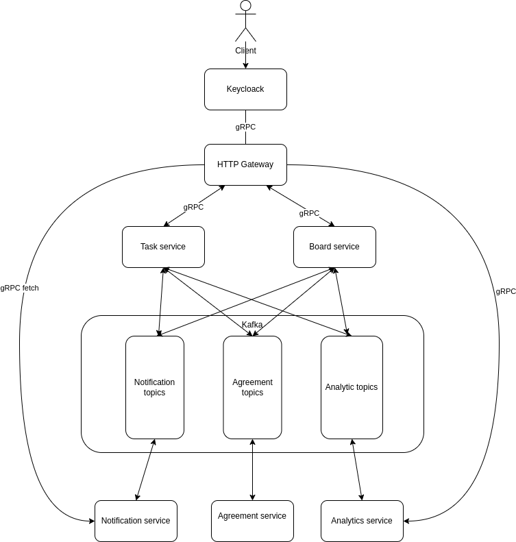

# Motion - Kanban Board Service

Разработка системы для взаимодействия с досками-канбан, при помощи которых можно управлять задачами, отслеживать статусы задач и планировать дальнейшие действия по достижению конкретной цели.

---

## Доменная область

Домен состоит из следующих сущностей:

- Таска/задача
- Канбан-доска
- Пользователь
- Уведомления
- Согласование

Каждая таска относится **только** к одной канбан-доске, каждая канбан-доска может содержать множество различных тасок (one-to-many). \
У каждой канбан-доски имеется определенный список пользователей, которые могут получить к ней доступ и права, соответствующие роли пользователя на доске.

---

## Бизнес-процессы системы

Выделяются следующие бизнес-процессы:

- Аутентификация пользователей (keycloak)
- Создание, редактирование тасок (task service)
- Создание, редактирование канбан-досок (board service)
- Согласование изменений в тасках (agreement service)
- Формирование аналитики о проекте (analytics service)
- Хранение и рассылка уведомлений (notification service)

---

## Сервисы

1. HTTP Gateway, распределяет запросы по сервисам

2. Keycloak для аутентификации

3. Сервис тасок - это планирование (первичный сервис в жизни проекта), в это входит

   - создание новых тасок
   - редактирование тасок
     - пример полей для редактирования: исполнитель, дедлайн, статус, приоритет, описание
   - добавление таске зависимость от других

   Изменения в этом сервисе перетекают через кафку в сервис досок, сервис аналитики, сервис согласования и сервис нотификаций. Является мастер-сервисом.

4. Сервис досок - это распределение задач по топикам (вторичный сервис в жизни проекта), в это входит

   - создание новых досок
   - редактирование досок

     - пример полей для редактирования: добавление в доску задач из пула уже имеющихся и согласованных, добавление различных топиков (например: backlog, todo, in progress, done)

   Изменения в этом сервисе перетекают через кафку в сервис тасок, сервис аналитики, сервис согласования и сервис нотификаций. Является мастер-сервисом.

5. Сервис согласований - после планирования новые задачи отправляются на согласование в этот сервис, где администраторы рассматривают изменения в плане, а затем принимают или отклоняют их

   - принятие изменений
   - отклонение изменений с указанием конкретной причины

   Интегрируется с другими сервисами через кафку.

6. Сервис аналитики

   - позволяет собирать данные о прогрессе проекта (затраченное время, самые "горячие" задачи, ...)
   - для задач с зависимостями: позволяет наглядно посмотреть, какие задачи блокируют прогресс и какие требуется выполнить, чтоб дойти до текущей задачи

   Интегрируется с другими сервисами через кафку.

7. Сервис нотификаций - хранение и рассылка различного рода уведомлений\*

   - формирует для каждого юзера свой фид, состоящий из уведомлений об изменениях

   Интегрируется с другими сервисами через кафку.

   \*имеет смысл лишь при создании UI

---

